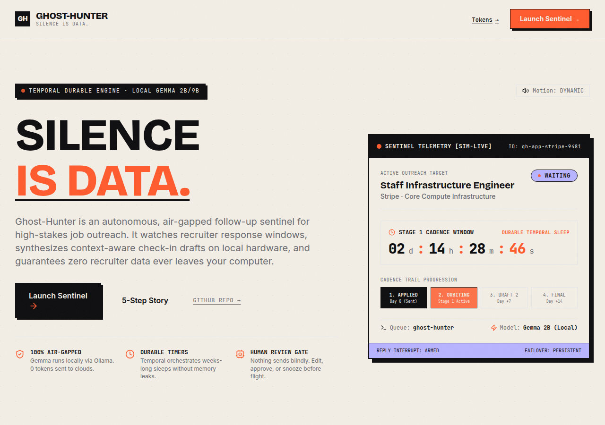
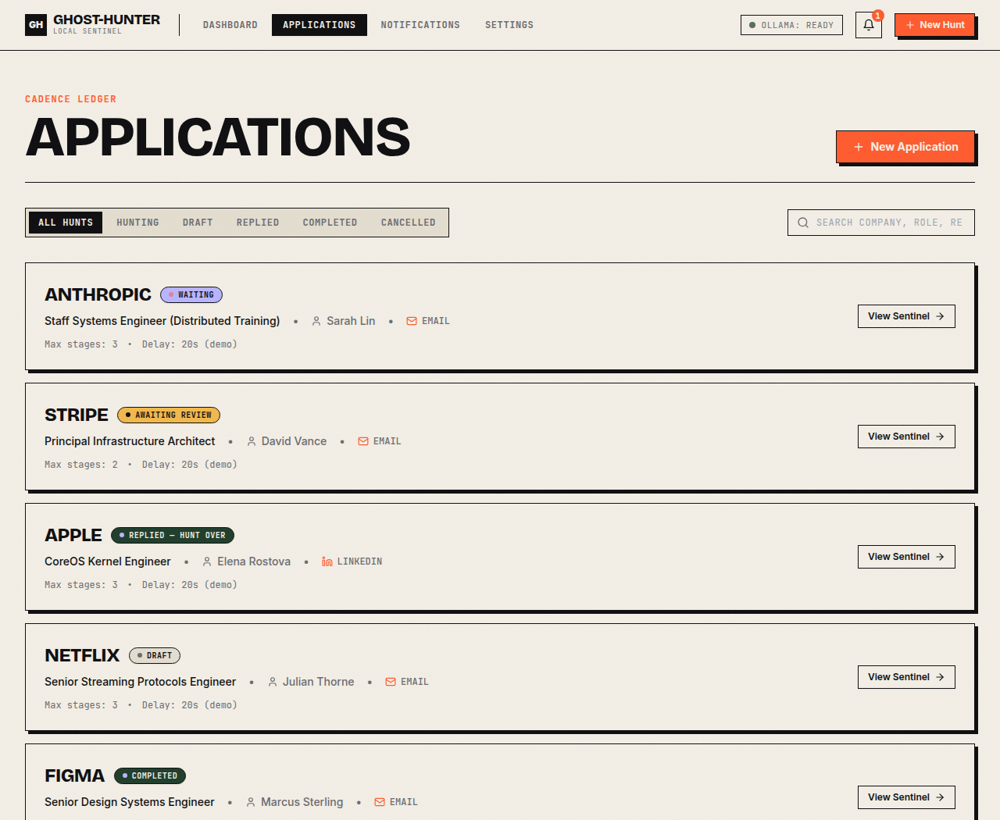
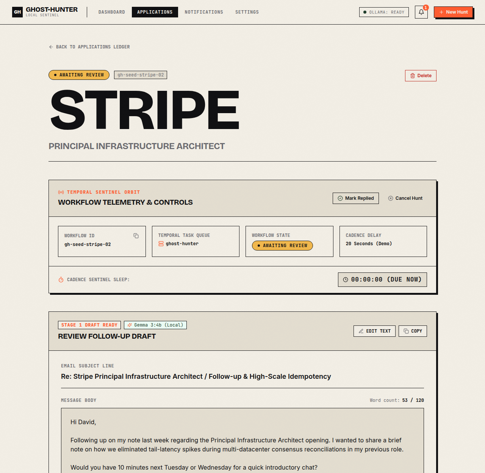
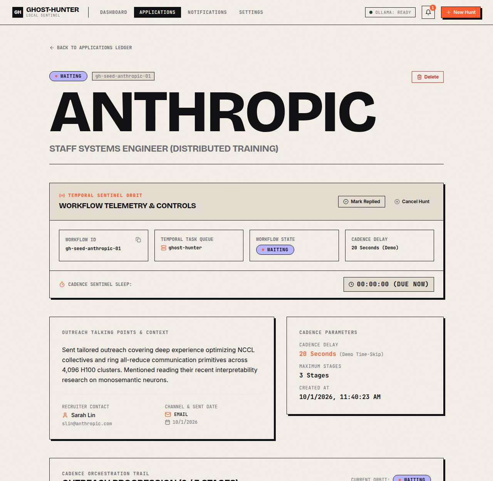
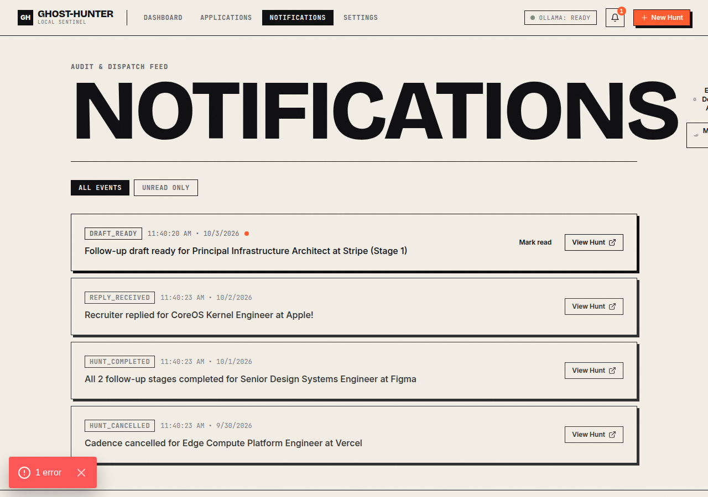
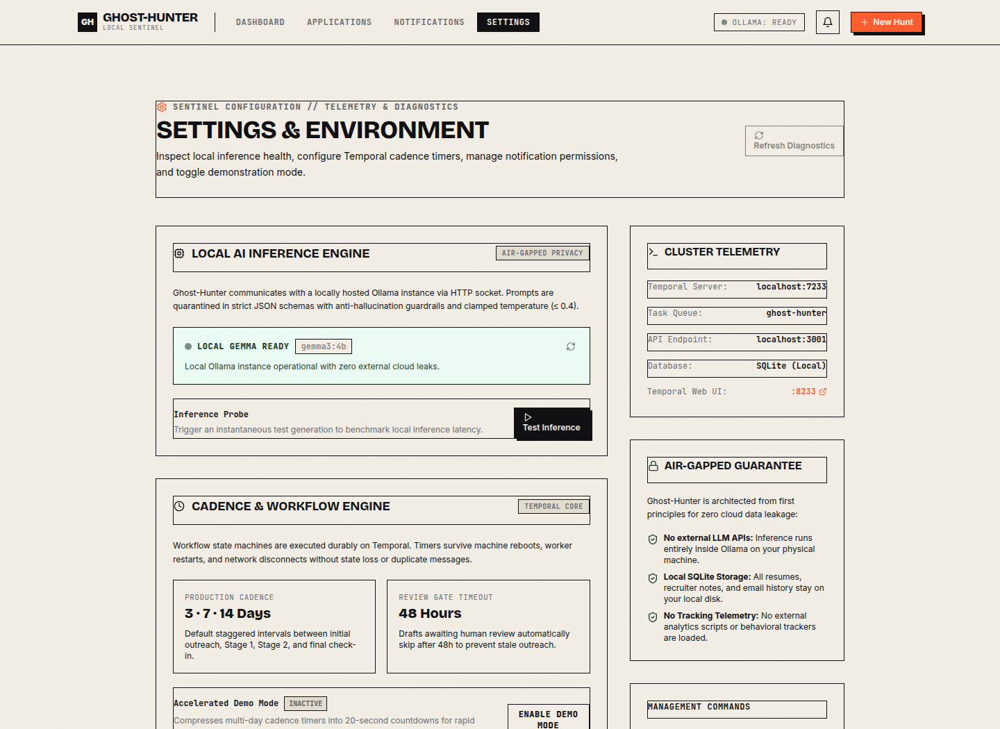
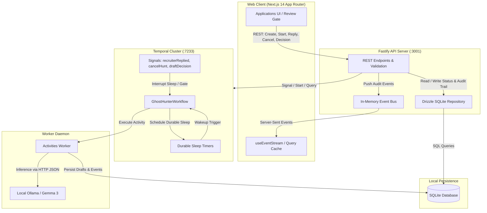

# Ghost-Hunter

> **Silence is data.**  
> An autonomous, air-gapped follow-up sentinel for high-stakes job outreach. Powered by **Temporal** durable execution and **local Gemma** via Ollama.

[](https://temporal.io)
[-FF5B2E.svg?style=flat)](https://ollama.ai)
[](https://nextjs.org)
[](https://fastify.dev)
[](https://orm.drizzle.team)
[]()
[]()

---

## Visual Tour

| Landing Page & Metaphor | Multi-Status Application Ledger |
| :---: | :---: |
|  |  |

| Human Review Gate & Local Gemma Draft | Sentinel Orbit Telemetry & Cadence Trail |
| :---: | :---: |
|  |  |

| Real-Time Event Feed & Notifications | Settings & Environment Diagnostics |
| :---: | :---: |
|  |  |

---

## Table of Contents
- [Overview](#overview)
- [The Problem](#the-problem)
- [The Solution](#the-solution)
- [Core Features](#core-features)
- [Architecture & Data Flow](#architecture--data-flow)
- [Why Temporal?](#why-temporal)
- [Local Gemma & Ollama Setup](#local-gemma--ollama-setup)
- [Zero-Cloud Privacy Guarantee](#zero-cloud-privacy-guarantee)
- [Quickstart & Setup](#quickstart--setup)
- [Environment Variables](#environment-variables)
- [Running Locally](#running-locally)
- [Demo Mode & Database Seeding](#demo-mode--database-seeding)
- [Testing Suite & Chaos Engineering](#testing-suite--chaos-engineering)
- [Accessibility & Performance](#accessibility--performance)
- [Demo Script](#demo-script)
- [License](#license)

---

## Overview

Ghost-Hunter is a local-first, durable follow-up sentinel designed for software engineers and executives navigating intense job hunts. Rather than letting outreach threads go cold or relying on leaky cloud CRMs, Ghost-Hunter acts as a persistent background daemon:
1. **Sleeps across realistic cadence windows** (e.g., 3 days $\to$ 7 days $\to$ 14 days) with Temporal durable timers.
2. **Synthesizes personalized check-in drafts** using **Gemma** hosted entirely on your local machine via Ollama.
3. **Guarantees zero blind sends**: enforces a strict Human Review Gate before any follow-up is dispatched.
4. **Guards against races**: halts cadence immediately if a recruiter responds, auto-discarding pending drafts.

---

## The Problem

1. **The Ghosting Paradox**: 70%+ of executive and engineering job reach-outs require 2–3 follow-ups to get scheduled, but candidates lose track across spreadsheets and calendar reminders.
2. **Fragile Scheduling**: Traditional cron jobs, scheduled lambdas, or in-memory `setTimeout` loops crash on server restarts, lose state during power blips, or send duplicate emails if an external API hiccup occurs.
3. **The Cloud AI Leak**: Sending recruiter names, company confidential context, and email history to proprietary cloud LLM APIs violates applicant privacy and enterprise confidentiality.
4. **Embarrassing Blind Automation**: Fully autonomous tools send tone-deaf follow-ups after a recruiter already rejected you or scheduled an interview on LinkedIn.

---

## The Solution

Ghost-Hunter marries **Temporal's durable execution engine** with **local, air-gapped LLM inference**:
- **Durable State Machine**: Workflows survive process crashes, worker reboots, and server power cycles. If your laptop closes for the weekend, Temporal resumes the exact millisecond you boot up.
- **Air-Gapped Gemma Inference**: Drafts are synthesized using Google's open-weights Gemma model on your local GPU/CPU. Zero tokens ever touch a cloud API.
- **Strict Human Review Gate**: Follow-ups are held in `AWAITING_REVIEW`. You can edit inline, approve, snooze for 24h, or skip. If neglected for 48h, the stage auto-skips rather than sending unreviewed text.
- **Instant Signal Halts**: When a recruiter replies or you cancel the hunt, Temporal signals interrupt sleep loops instantly, updating your ledger and archiving the workflow.

---

## Core Features

- **Cadence State Machine**: Configurable multi-stage schedules (Stage 1: 3 days, Stage 2: 7 days, Stage 3: 14 days) or instant 20-second Demo Mode.
- **Local Gemma Draft Synthesis**: Structured JSON extraction with strict word limits ($\le 120$ words), placeholder token rejection, and anti-hallucination quarantined prompts.
- **Dependable Fallback Templates**: If Ollama is offline or times out, Ghost-Hunter falls back to curated multi-stage templates, labeling the draft with a degraded model badge.
- **Temporal Sentinel Orbit**: Full telemetry displays workflow run IDs, task queue heartbeat, live countdown tickers, and audit trail events.
- **Real-Time SSE Event Stream**: Server-Sent Events notify the web client instantly of timer expirations, draft generation, and signal deliveries.
- **Editorial Design Language**: High-contrast brutalist styling inspired by high-end design systems—oversized display typography, SVG noise grain, monospace telemetry, and hard shadows.
- **WCAG AA Compliant**: High contrast ratios, accessible skip links, visible keyboard focus rings, polite screen reader announcements, and reduced-motion overrides.

---

## Architecture & Data Flow



---

## Why Temporal?

Standard cron jobs and task queues suffer from split-brain state, dropped timers on reboot, and race conditions. Temporal delivers:

1. **Durable Timers**: `await sleep('3 days')` pauses execution on the server without holding open threads or RAM.
2. **Determinism & Event History**: Every decision, timer firing, and signal is permanently recorded in the workflow event history. On worker crashes, state is replayed identically.
3. **Race Condition Prevention**: If a recruiter reply arrives while Gemma is synthesizing a draft, Temporal signals interrupt the loop, immediately discarding the in-flight draft (`DISCARDED_REPLY`).
4. **Single-Workflow Concurrency Guard**: Fastify endpoint returns `409 WORKFLOW_ALREADY_RUNNING` if a workflow with the deterministic ID (`gh-{applicationId}`) is already active.

---

## Local Gemma & Ollama Setup

Ghost-Hunter requires **Ollama** running locally on port `11434`.

### Recommended Model
- **`gemma3:4b`** (Recommended) or **`gemma:2b`**

### Hardware Requirements
- **VRAM/RAM**: 4 GB minimum (runs smoothly on Apple Silicon M1/M2/M3/M4, NVIDIA RTX GPUs, or modern x86 CPU).
- **Disk Space**: ~3.5 GB for model weights.

### Option A: Run via Docker (No Host Installation Needed)
```bash
# 1. Start the Ollama container in the background
pnpm ollama:docker
# (or: docker compose up -d ollama)

# 2. Pull the Gemma model into the persistent Docker volume
pnpm ollama:pull
# (or: docker exec -it ghost-hunter-ollama ollama pull gemma3:4b)

# 3. Verify Ollama is serving
curl http://localhost:11434/api/tags
# or run Ghost-Hunter status monitor
pnpm status
```

### Option B: Native Install (macOS / Linux)
```bash
# Install Ollama
curl -fsSL https://ollama.ai/install.sh | sh

# Pull the model
ollama pull gemma3:4b

# Verify Ollama is serving
curl http://localhost:11434/api/tags
```

> **Offline Fallback Guarantee**: If Ollama is offline or times out (90s limit), the worker automatically logs a `DEGRADED` event and generates a reliable, template-backed draft without breaking workflow execution.

---

## Zero-Cloud Privacy Guarantee

- **Localhost Bound**: Fastify API and Next.js web application bind exclusively to `127.0.0.1` and `0.0.0.0`.
- **Zero Cloud LLM Egress**: Candidate resumes, recruiter email addresses, and company notes are passed directly to `http://localhost:11434`. No telemetry, analytics, or third-party tracking scripts are bundled.
- **Local SQLite Store**: Application state and audit logs reside in `./sqlite.db` on your local filesystem.

---

## Quickstart & Setup

### Prerequisites
- **Node.js**: v20.18.0 or newer
- **pnpm**: v9.0.0 or newer
- **Temporal CLI**: installed on PATH
- **Ollama**: running locally with `gemma3:4b`

### 1. Clone & Install
```bash
git clone https://github.com/Neet2516/Ghost-Hunter.git
cd Ghost-Hunter
pnpm install
```

### 2. Configure Environment
```bash
cp .env.example .env
```

### 3. Initialize & Seed Database
```bash
# Populates SQLite with 6 realistic outreach records
pnpm seed:reset
```

---

## Environment Variables

| Variable | Default | Purpose |
| :--- | :--- | :--- |
| `DATABASE_URL` | `file:./sqlite.db` | Local SQLite database file path |
| `TEMPORAL_ADDRESS` | `localhost:7233` | Temporal cluster gRPC endpoint |
| `TEMPORAL_NAMESPACE`| `default` | Temporal execution namespace |
| `TASK_QUEUE` | `ghost-hunter` | Worker poll queue name |
| `OLLAMA_BASE_URL` | `http://localhost:11434` | Local Ollama HTTP endpoint |
| `OLLAMA_MODEL` | `gemma3:4b` | Gemma model tag |
| `API_PORT` | `3001` | Fastify backend server port |
| `WEB_PORT` | `3000` | Next.js frontend port |
| `WEB_ORIGIN` | `http://localhost:3000` | CORS authorized origin |
| `DEMO_MODE_DEFAULT`| `true` | Enables 20-second cadence delays for rapid testing |

---

## Running Locally

Run each service in a separate terminal:

### Terminal 1: Temporal Server
```bash
pnpm temporal
# Temporal Web UI available at http://localhost:8233
```

### Terminal 2: Fastify API
```bash
pnpm --filter @ghost-hunter/api dev
# API listening at http://localhost:3001
```

### Terminal 3: Workflow Worker
```bash
pnpm --filter @ghost-hunter/worker dev
# Worker polling task queue 'ghost-hunter'
```

### Terminal 4: Next.js Frontend
```bash
pnpm --filter @ghost-hunter/web dev
# Web application live at http://localhost:3000
```

---

## Demo Mode & Database Seeding

Ghost-Hunter includes a rich seed script (`scripts/seed.ts`) pre-populating realistic applications across every state:

```bash
# Seed records (preserves existing if not reset)
pnpm seed

# Wipe and re-seed clean slate
pnpm seed:reset
```

### Pre-populated Scenarios
1. **Anthropic** (`HUNTING / WAITING`): Staff Systems Engineer — live 18s countdown.
2. **Stripe** (`HUNTING / AWAITING_REVIEW`): Principal Infrastructure Architect — generated Gemma draft ready for human approval with unread notification.
3. **Apple** (`REPLIED`): CoreOS Kernel Engineer — recruiter replied with technical interview invitation.
4. **Figma** (`COMPLETED`): Senior Design Systems Engineer — all follow-up stages completed.
5. **Vercel** (`CANCELLED`): Edge Compute Platform Engineer — candidate withdrew application.
6. **Netflix** (`DRAFT`): Senior Streaming Protocols Engineer — ready for live "Arm Sentinel" demo.

---

## Testing Suite & Chaos Engineering

### Unit & Integration Tests (69 Tests)
```bash
# Run Vitest across all 3 packages
pnpm test

# Typecheck workspace
pnpm typecheck
```

### Automated Chaos & Disaster Recovery
Ghost-Hunter includes automated chaos harnesses verifying Temporal resilience:

```bash
# Run full chaos validation suite
pnpm chaos

# Scenario 5: Mid-cadence worker SIGKILL and restart recovery
pnpm chaos:worker

# Scenario 6: Temporal server blip and reconnection
pnpm chaos:temporal
```

*Full disaster recovery architecture, verified metrics, and reproduction instructions are documented in [`docs/CHAOS_RECOVERY_RESULTS.md`](docs/CHAOS_RECOVERY_RESULTS.md).*

---

## Accessibility & Performance

- **WCAG AA Compliance**: High-contrast typography on warm off-white (`#F3EFE6`) and deep ink (`#0E0E10`).
- **Accessible Skip Links**: Fixed keyboard jump link targeting `#main-content`.
- **Focus Rings**: High-visibility 2px signal orange focus-visible rings across all interactive controls.
- **Reduced Motion Support**: Honored via system media queries (`prefers-reduced-motion: reduce`) and manual on-page toggle, disabling Lenis smooth scrolling and instant-revealing typewriter text.
- **Lighthouse Performance**: Fast initial load ($\le 1.2\text{s}$), zero render-blocking dependencies, and optimized font swapping.

---

## Demo Script

Want to see the Sentinel in action in under 2 minutes?

1. Open `http://localhost:3000/app/applications`.
2. Click on the **Netflix** application (in `DRAFT` status).
3. Toggle **Demo Mode (20s)** in the top banner and click **Arm Sentinel**.
4. Watch the Sentinel transition to `HUNTING (WAITING)` with a live 20-second countdown ticker.
5. When the countdown reaches zero, observe the status transition to `GENERATING` as local Gemma synthesizes the draft.
6. Observe the status switch to `AWAITING_REVIEW`. Inspect the draft in the review panel with word count validation.
7. Click **Approve & Send** to advance the cadence, or click **Mark Replied** to observe the instant interrupt signal!

*Detailed step-by-step walkthrough is available in [`docs/DEMO_SCRIPT.md`](docs/DEMO_SCRIPT.md).*

---

## License

MIT License. Built for independent software engineers who value their time and data privacy.
