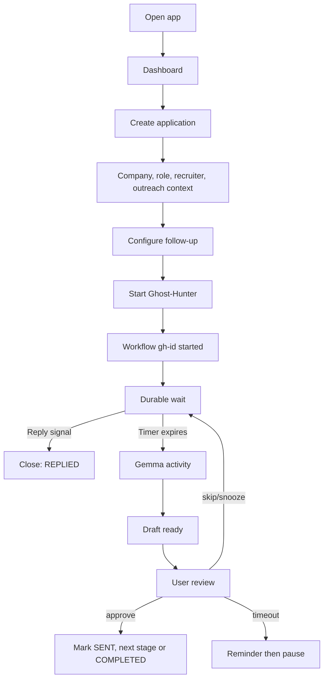
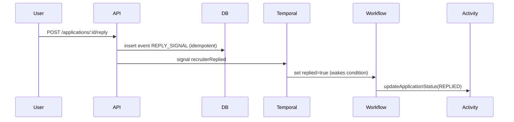
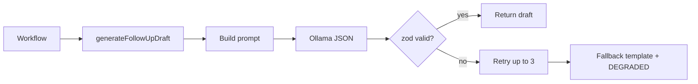
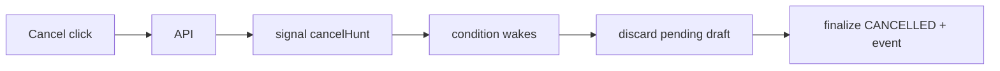

# Application Flow

## Application lifecycle
```mermaid
stateDiagram-v2
 [*] --> DRAFT --> HUNTING --> REPLIED
 HUNTING --> CANCELLED
 HUNTING --> COMPLETED
 HUNTING --> FAILED
```
## Follow-up lifecycle
```mermaid
stateDiagram-v2
 [*] --> PENDING --> GENERATING --> READY
 READY --> SENT
 READY --> SKIPPED
 READY --> SNOOZED --> PENDING
 GENERATING --> DISCARDED_REPLY
 READY --> DISCARDED_REPLY
```
## Recruiter signal flow

## AI generation flow

## Cancellation flow

## Race condition (reply right before timer)
Workflow checks `replied` after every await including after the draft activity. Reply wins if the signal is processed before the draft is committed; the draft is marked DISCARDED_REPLY and no notification is raised. Temporal orders signals and timers deterministically in history.
## Error/retry flow — see ARCHITECTURE.md.
