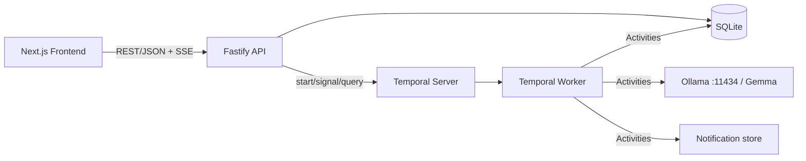
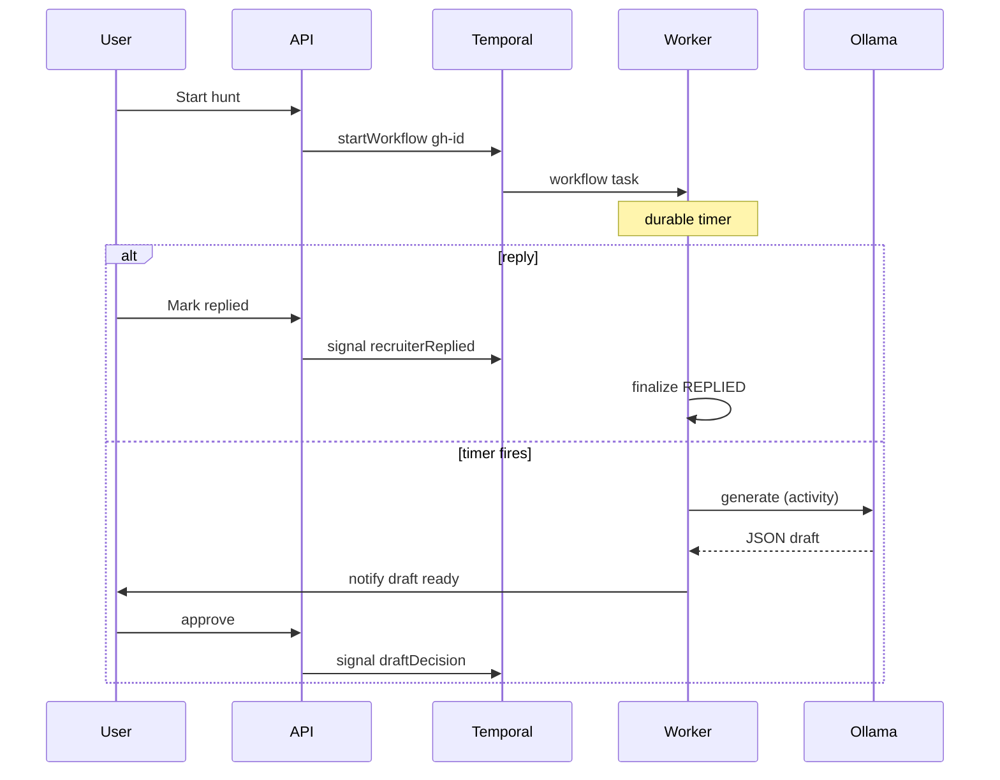
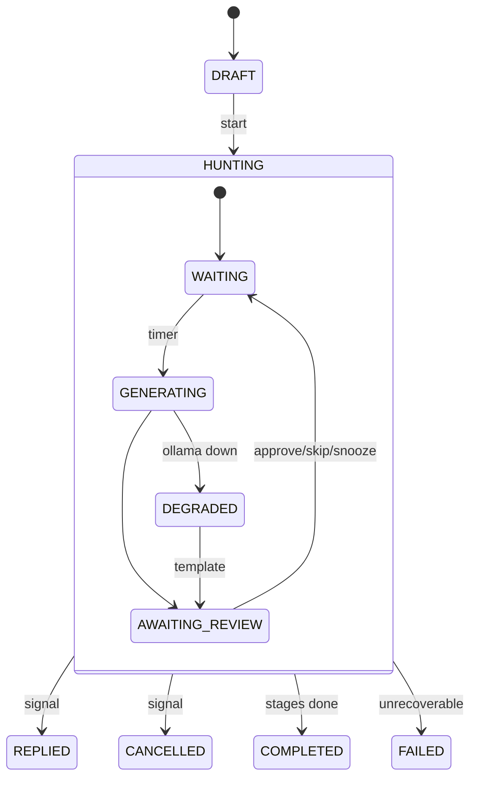
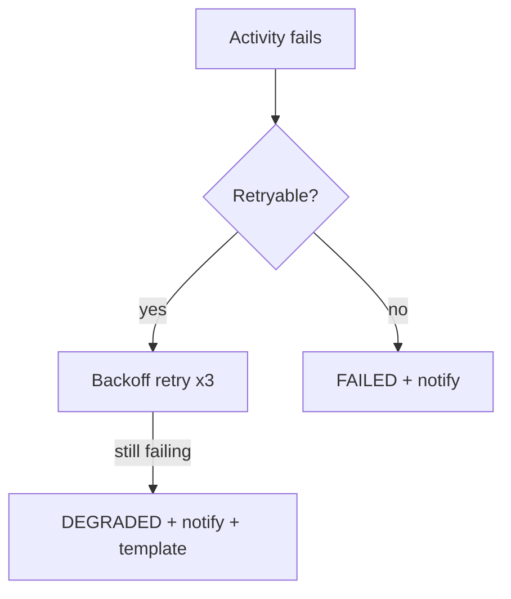

# Architecture



## Components
| Component | Responsibility | In → Out | Depends on | Failure mode & handling |
|---|---|---|---|---|
| Frontend (Next.js) | UI, storytelling, review UX | user input → API calls; SSE events | API | API down → error state with retry |
| API (Fastify, TS) | Validation, CRUD, workflow client (start/signal/query/cancel) | HTTP → DB rows, Temporal calls | DB, Temporal | Temporal down → 503, application stays DRAFT; no half-started state (start workflow, then mark HUNTING; reconcile on boot) |
| Temporal server | Durable state, timers, history | — | its DB | Restart → resumes; tested |
| Worker | Runs workflows + activities | tasks → results | Temporal, DB, Ollama | Crash → tasks re-dispatched after restart |
| Workflow `ghostHunterWorkflow` | Deterministic orchestration: wait, signals, stage loop, status transitions | input config → final status | none (no I/O) | Non-determinism avoided: no Date.now/Math.random/fetch; use workflow APIs only |
| Activities | Side effects: `generateFollowUpDraft`, `persistEvent`, `updateApplicationStatus`, `notifyUser`, `checkModelHealth` | args → result | Ollama, DB | Retry policy; non-retryable for validation errors |
| Database (SQLite + Drizzle) | App-level read model, events, drafts, notifications | — | disk | Source of truth for UI lists; Temporal is truth for *workflow state* |
| Ollama + Gemma | Local inference (`gemma3:4b` default; configurable) | prompt → JSON | local GPU/CPU | Unreachable/malformed → retry → DEGRADED + template |
| Notifications | DB-backed feed + SSE push + Browser Notification | event → UI | API | Failure logged, non-fatal (retry 3x) |
| Auth | None in MVP (localhost single user); optional shared passcode env | — | — | — |
| External integrations | None in MVP | — | — | — |

## Workflow design (pseudocode, not implementation)
```
input: {applicationId, delayMs, maxFollowUps, reviewTimeoutMs, context}
state: {status, stage, repliedAt?, draftId?}
signals: recruiterReplied, cancelHunt, draftDecision{action, editedBody?}
query: getState

for stage in 1..maxFollowUps:
  setStatus(WAITING)
  woke = await condition(() => replied||cancelled, delayMs)   // durable timer
  if replied -> finalize(REPLIED); if cancelled -> finalize(CANCELLED)
  setStatus(GENERATING)
  draft = await act.generateFollowUpDraft(...)                 // retries; fallback -> DEGRADED
  if replied||cancelled after activity -> discard draft, finalize   // RACE GUARD
  setStatus(AWAITING_REVIEW); act.notifyUser(draftReady)
  await condition(() => decision||replied||cancelled, reviewTimeoutMs)
  handle approve/skip/snooze/timeout
finalize(COMPLETED)
```
Rules: workflow ID `gh-{applicationId}` with reuse policy REJECT_DUPLICATE for running; signals are idempotent (flag set); status writes happen via `updateApplicationStatus` activity; long histories avoided (≤3 stages, no continue-as-new needed).

## AI flow
Prompt = system rules + structured context (company, role, recruiter first name, original outreach summary, stage, days since). Recruiter/user text is wrapped as data. Request `format: json` schema `{subject: string, body: string}` from Ollama. Validate with zod: body ≤ 120 words, non-empty, no placeholder tokens like `[Name]`. Invalid → throw retryable error (max 3), then fallback template and DEGRADED flag.

## Retry policy
generateFollowUpDraft: timeout 90s, 3 attempts, backoff 2s×2, non-retryable: `ValidationConfigError`. DB/notify activities: 5 attempts, 1s backoff.

## Cancellation
API `POST /applications/:id/cancel` → Signal `cancelHunt` (graceful) ; workflow finalizes, persists event. Hard terminate only for delete.

## Mermaid diagrams



