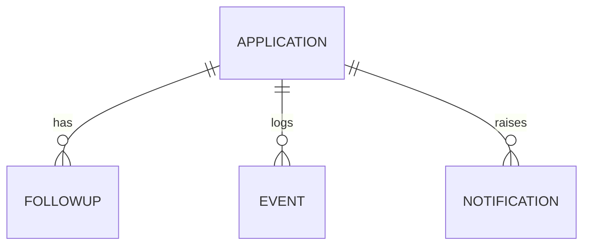

# Data Model
Kept entities: Application, Recruiter (embedded fields in Application for MVP), FollowUp (stage + draft), Event, Notification. Dropped: User (single-user), Company (string), Workflow (derived from ID), AIDraft (merged into FollowUp).

**Application** — id (uuid, req), company (req), role (req), recruiterName (req), recruiterContact (opt), outreachChannel (email|linkedin|other, req), outreachContext (text, req), outreachSentAt (req), delayMs (req), maxFollowUps (1–3, req), status (DRAFT|HUNTING|REPLIED|CANCELLED|COMPLETED|FAILED), subStatus (WAITING|GENERATING|AWAITING_REVIEW|DEGRADED|null), nextActionAt (opt), workflowId (opt, unique), createdAt, updatedAt. Lifecycle: see PRD §13.
**FollowUp** — id, applicationId (FK), stage (int), subject, body, source (gemma|template), status (GENERATING|READY|SENT|SKIPPED|SNOOZED|DISCARDED_REPLY), editedBody (opt), createdAt, decidedAt (opt).
**Event** — id, applicationId (FK), type (CREATED, HUNT_STARTED, TIMER_FIRED, REPLY_SIGNAL, DRAFT_READY, DRAFT_APPROVED, DRAFT_SKIPPED, RETRY, DEGRADED, CANCELLED, COMPLETED, ERROR), payload (json), at. Append-only; drives timeline.
**Notification** — id, applicationId, kind, message, readAt (opt), createdAt.
Indexes: Application.status, Event(applicationId, at).
